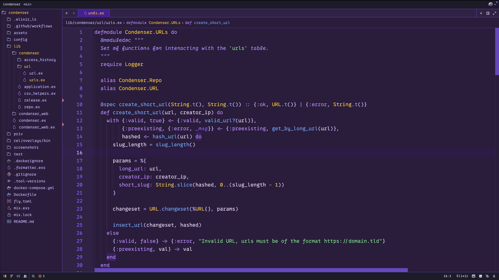

# grimaces-birthday
[Zed IDE](https://zed.dev/) theme to help you get in the mood for your favorite holiday of the year

## Installation
To install from Zed, open up the extensions menu (`cmd` + `shift` = `p`), then search for the `zed: extenstions` command. From there, search for `Grimace's Birthday` and install it. Once installed, you can pick the theme from the theme picked (`cmd` + `k` + `t`).

## Screenshot

